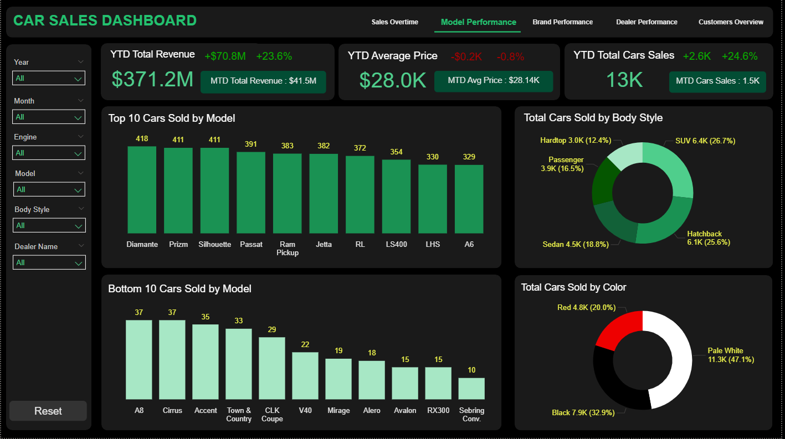
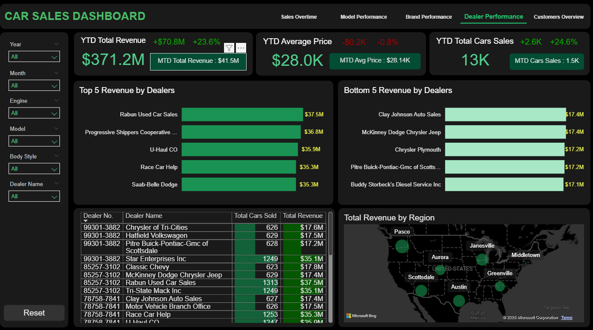
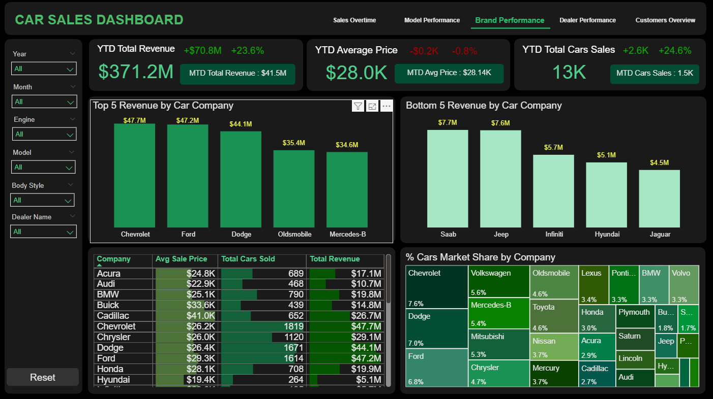
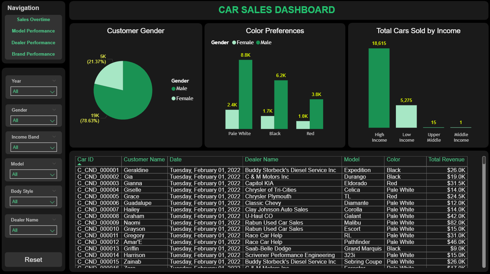
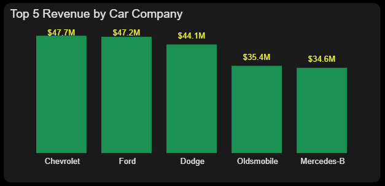
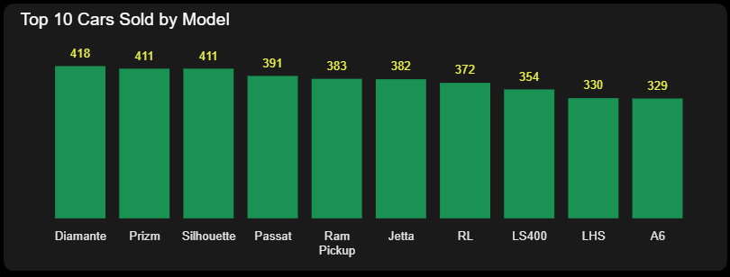
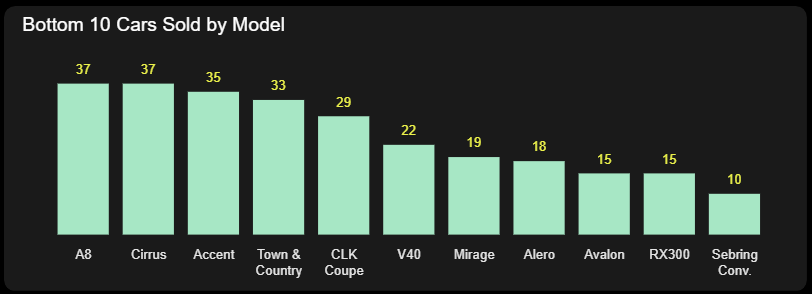
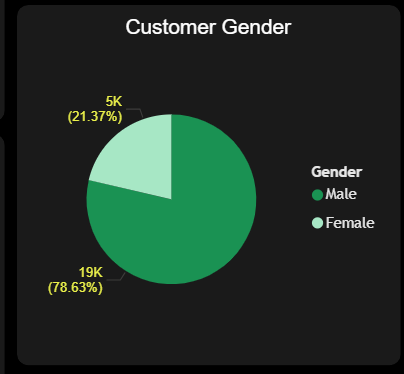
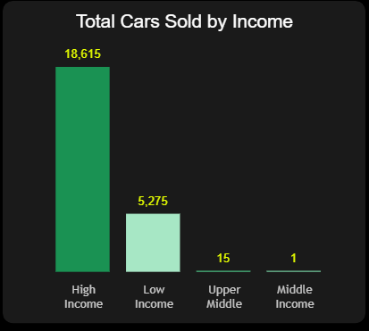
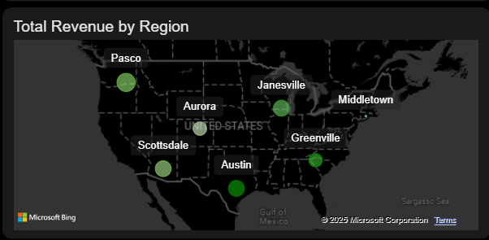

# 🚗 Car Sales Dashboard – Power BI Project

This project presents a **comprehensive dashboard built in Power BI** to analyse car sales performance. It showcases key performance indicators (KPIs), sales trends, profitability, and customer behaviour to help stakeholders make informed business decisions. Data source 

---

##📌 Summary

This repository contains a production‑ready Power BI dashboard (Car Sales Dashboard.pbix) and documentation for exploring sales trends, profitability, customer behaviour and dealer performance. The dashboard is designed for quick executive readouts and deeper ad‑hoc analysis via slicers and drill‑through.

## 🎯 Project Objective

- Provide a single source of truth for revenue, units sold, and customer mix.
- Enable drill‑downs by brand / model / body style / engine, dealer, region and date.
- Surface top/bottom performers and YoY/YTD trends for fast decision‑making.

---

## 📊 Tools & Technologies

- **Power BI Desktop**  
- **DAX (Data Analysis Expressions)**  
- **Data Modeling & Relationships**  
- **Excel / CSV Data Sources**

---

## 🧩 Data Model (Star Schema)

- **FactSales:** Date, ProductID, DealerID, CustomerID, Units, UnitPrice, Cost, Revenue, Profit
- **Dimension DateTable:** Date, Year, Quarter, Month, Day, Week
- **Dimension Car Model:** Brand, Model, BodyStyle, Engine, Colour
- **Dimension Dealer:** DealerID, DealerName, Region
- **Dimension Customer:** CustomerID, Gender, AgeBand

The model uses one-to-many relationships from each dimension to FactSales on surrogate keys. The Dimension Date[DateTable] table is marked as a Date table.

---

## 📈  Dashboard Pages & Visuals

**1. Sale Overview** 
   – KPI cards: YTD Total Revenue, YTD Average Price, Profit, YTD Total Car Sales, YTD Total Customers
   - Sales over Time: Days/Month/Year with YOY variance
  

**2. Model Performance**
   - Top/Bottom 10 Model by quantity solds
   - Quantity Solds by body styles and colors
  

**3. Dealer Performance**
   - Top/Bottom 5 dealers by revenue
   - Regional heat (City / State)
  

**4. Brand Performance**
   - Top/Bottom 5 Companies by revenue
   - % Car Market Share by company
  

**5. Customer Overview**
   - Color Preferences by Gender, Customer's Income Band
   - Customers Information
  

---

## 🔍 Key Insights

💰 **Top car companies** include **Chevrolet($47.7M)**, **Ford ($47.2M)**, and **Dodge ($44.1M)**, contributing highest total revenue.
   

🛍️ **Diamante** and **Prizm** generated highest revenue among individual models.
   

📉 **RX300** and **Sebring Conv.** were among the least performing models.
   

🧍 **Male customers** represent ~79% of total purchases.
   

🏙️ **High income customers** contributed the most to total car sales.
   

📌 **Dealers like Rabun Used Car Sales($37.5M)** and **Progressive Shippers Cooperative Association($36.8M)** led in revenue.
   

🗺️ **Regions such as Pasco and Janesville** performed best in sales volume and dealer performance.
   

---

## 🧠 Skills Demonstrated

 ✅ Power BI data modeling with relationships across multiple tables  
 ✅ DAX formulas for calculated columns and KPIs  
 ✅ Interactive visuals (slicers, cards, line/bar/donut charts)  
 ✅ Dashboard design for clarity and storytelling  
 ✅ Parameter controls and dynamic data filtering

